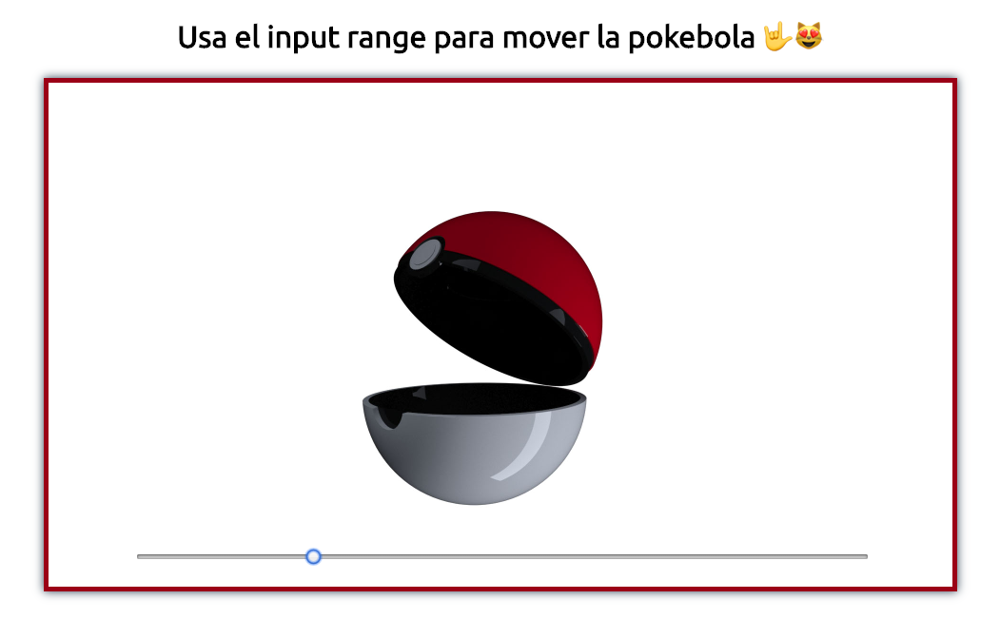

# Imagen 360 JavaScript 💪
___

Este código mustra el como crear una vista de 360 usando diferetes imagenes. 

Este proyecto usa las tecnologías:
* HTML5 
* CSS
* JS
* CANVAS 

La vista final del proyecto es identica a esta imagen:

Este proyecto fue creado con la ayuda de un video de youtube creado por [Leonidas Esteban](https://github.com/LeonidasEsteban/360-javascript)

